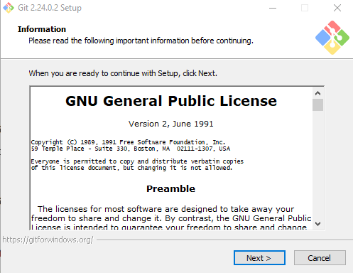

# LatihanVCS
## TUTORIAL CARA PENGGUNAAN GIT
## Cara Install Git
 Ini adalah langkah-langkah cara penggunaan git mulai dari cara mendownload gitbash hingga bisa menggunakan git
  #### 1.Download File Git
 file git bisa didownload di situs resmi git (git-scm.com). Download sesuai tipe sistem operasi pada komputer Anda. Apabila tipe sistem operasi komputer Anda 64bit,  pilih Git yang mendukung Windows 64bit. Tujuannya adalah agar tidak terjadi error saat proses instalasi Git.
 (IMAGE)
 #### 2. Install Git
Setelah selesai mengunduh file Git, buka setup aplikasi Git untuk memulai proses instalasi. Halaman awal setelah Anda membuka setup aplikasi Git adalah tampilan Document License dari Git. Klik Next untuk melanjutkan instalasi.

Berikut ini adalah tampilan proses instalasi Git. Tunggu hingga proses selesai dan Anda bisa menggunakan Git pada Windows.

#### 3. Cek Versi Git
setelah proses instalasi selesai kemudian kita cek apakah instalasi berjalan dengan benar atau ada error dengan mengecek versi dari git melalui **Command Prompt**. Klik Win+R lalu ketik CMD untuk membuka Command Prompt seperti di bawah ini.
(IMAGE)
Selanjutnya masukkan perintah berikut untuk cek versi git dan cek apakah Git sudah terinstall di komputer Anda.
**git --version**
Jika Git berhasil terinstall, maka akan terlihar versi dari git kita
(IMAGE)
## Cara Menggunakan Git
#
#### 1. Login Git
Pada saat pertama kali menggunakan git, perlu dilakukan konfigurasi
user .name dan user.email. konfigurasi ini bisa dilakukan untuk global repostiry atau individual
repository. apabila belum dilakukan konfigurasi, akan mengakibatkan terjadi kegagalan
saat menjalankan perintah git commit
masukkan username GitHub Anda menggunakan perintah di bawah ini. Lalu tekan ENTER jika sudah benar.

**$ git config --global username "UsernameAnda"**
**$ git config --global user.email "IsiDenganEmailAnda @gmail.com"**

Selanjutnya untuk memastikan proses login Anda berhasil, masukkan perintah berikut.

**$ git config --list**
(IMAGE)

#### 2. Buat Folder pada Windows
Selanjutnya, Anda perlu membuat folder pada local disk komputer Anda. Fungsinya adalah untuk menyimpan update file yang telah Anda buat.
(IMAGE)

#### 3. Buka Folder Menggunakan Git Bash
Setelah berhasil membuat folder pada local disk komputer Anda,  buka folder tersebut dengan cara klik kanan lalu pilih **Git Bash Here**. 
(IMAGE)
Setelah itu akan muncul **_Git Bash Command_**
(IMAGE)

#### 4. Buat Direktory Project
Kemudian setelah login kita bisa membuat directory untuk project pertama yang kita namai misalkan LatihanVCS dengan menuliskan

**$ mkdir latihanVCS**
**$ cd latihanVCS**
(IMAGE)
#### 5. Ubah Folder Menjadi Repository
Setelah itu, ubah folder tersebut menjadi repository menggunakan perintah berikut:

**$ git init**

Repository baru berhasil di inisialisasi, dengan terbentuknya satu
direktori hidden dengan nama .git
#### 7. Menambahkan File Baru ke Repository
Untuk membuat file dapat menggunakan text editor, lalu menyimpan
filenya pada direktori aktif (repository)
Lalu buat file disini kita akan coba buat satu file bernama README .md (text file) dengan perintah :

**$ git add README .md**

#### 8. Membuat Commit 
Selanjutnya, Anda perlu membuat Commit. Commit berfungsi untuk menambahkan update file serta komentar. Jadi setiap kontributor bisa memberikan konfirmasi update file di proyek yang sedang dikerjakan. Masukkan perintah berikut untuk membuat Commit:

**$ git commit -m "File pertama saya"**

#### 9. Membuat Akun Github
Dalam belajar menggunakan Git Anda harus login ke dalam website GitHub. Github dan Git memiliki hubungan khusus, yaitu Git yang berperan sebagai version control system dan Github menjadi hosting atau sebagai penyimpan kode pemrograman.
Setelah Anda login, akan muncul tampilan dashboard dari GitHub seperti  gambar di bawah ini.
(IMAGE)
#### 10. Membuat Repository Server
Setelah berhasil login ke GitHub, Anda bisa mulai membuat repository. Klik tombol New pada menu Repositories untuk membuat repository baru.
(IMAGE)
(IMAGE)
Kemudian Anda akan diarahkan pada halaman untuk membuat repository baru seperti gambar di bawah ini.

Anda perlu mengisi detail informasi berikut:

* Nama Repository : digunakan untuk identitas repository yang dibuat.
* Deskripsi Repository : berfungsi untuk deskripsi dari repository yang dibuat.
* Jenis Repository   : jenis repository  dibagi menjadi Public dan Private. Ketika Anda mengatur repository menjadi Public, orang lain dapat melihat repository yang Anda buat. Sebaliknya, jika Anda mengaturnya sebagai Private, repository tersebut hanya bisa diakses oleh Anda.

Setelah mengisi detail informasi di atas, klik Create Repository.
#### 12. Menambahkan Remote Repository
Remote Repository merupakan repository server yang akan digunakan untuk menyimpan setiap perubahan pada local repository, sehingga dapat diakses oleh banyak user. 
Untuk menambahkan remote repository server, gunakan perintah

**git remote add origin [url]**

#### 13. Push Ke Github (Mengirim perubahan ke server)
Langkah terakhir adalah push ke GitHub Push ini berfungsi untuk mengirim hasil akhir dari perubahan pada local repository ke server gunakan perintah git push.

**$ git push -u origin master**

Perintah di atas akan menampilkan pop up sign in GitHub. Anda perlu login untuk melanjutkan proses push ke GitHub. 
(IMAGE)
Jika proses login berhasil, akan muncul tampilan Command Prompt seperti di bawah:
# (IMAGE)
#### 14. Cek File 

Setelah itu, cek repository yang telah Anda buat. Anda akan mendapati file-file yang telah ditambahkan sebelumnya.
# (IMAGE)